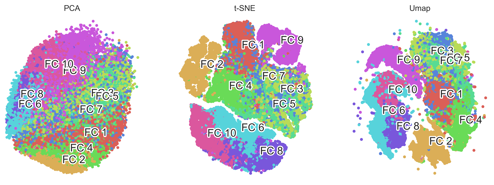

# Data visualization comparision for different face image categories

This repository compares the representation of different face categories across layers of DCNN, from early pooling layers to fully connected layers to see when categories are clearly represented/separated.

To this end, I used common visualization (or dimension reduction) methods including:
1. [**PCA**](https://scikit-learn.org/stable/modules/generated/sklearn.decomposition.PCA.html)
2. [**t-SNE:**](https://scikit-learn.org/stable/modules/generated/sklearn.manifold.TSNE.html) Developed by [**Laurens van der Maaten**](http://lvdmaaten.github.io/) and [**Geoffrey Hinton**](http://www.cs.toronto.edu/~hinton/) (see the [original paper here](http://jmlr.csail.mit.edu/papers/volume9/vandermaaten08a/vandermaaten08a.pdf))
3. [**UMAP:**](https://github.com/lmcinnes/umap) Developed by **Leland McInnes**, **John Healy**, and **James Melville** (see the [original paper here](https://arxiv.org/abs/1802.03426), and documentation is available via [ReadTheDocs](https://umap-learn.readthedocs.io))

To start with, I first compared the performance of these three methods on [**MNIST-Fashion database**](https://github.com/zalandoresearch/fashion-mnist):

Visual inspection shows that [UMAP](https://github.com/lmcinnes/umap) has done a better job as [MNIST-Fashion](https://github.com/zalandoresearch/fashion-mnist) categories are better clustered compared to [PCA](https://scikit-learn.org/stable/modules/generated/sklearn.decomposition.PCA.html) and [t-SNE](https://scikit-learn.org/stable/modules/generated/sklearn.manifold.TSNE.html). Moreover, comparing the computation time on my laptop showed that [UMAP](https://github.com/lmcinnes/umap) also wins this competition (note that PCA is the quickest but did not provide nice resluts):

| Method | Epalsed time |
| --- | --- |
| PCA | 1.34 sec |
| TSNE | 6083.97 sec |
| UMAP | 54 sec |

Next step is to apply the methods to may face image categories.... 
